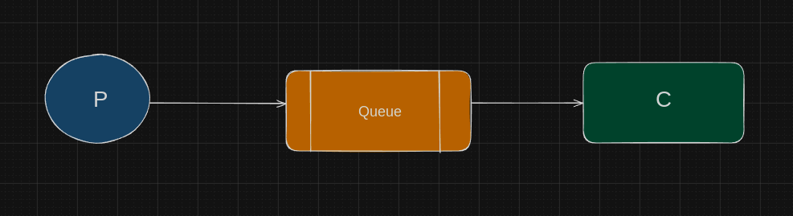
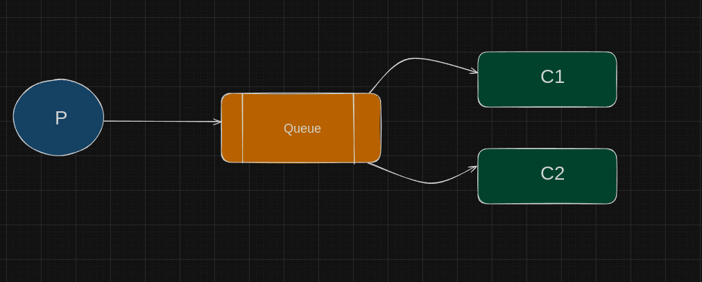
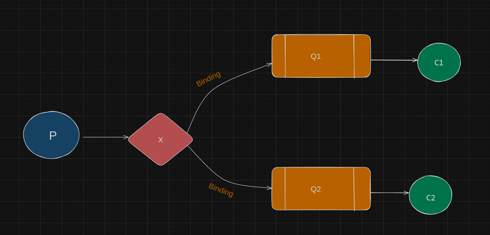
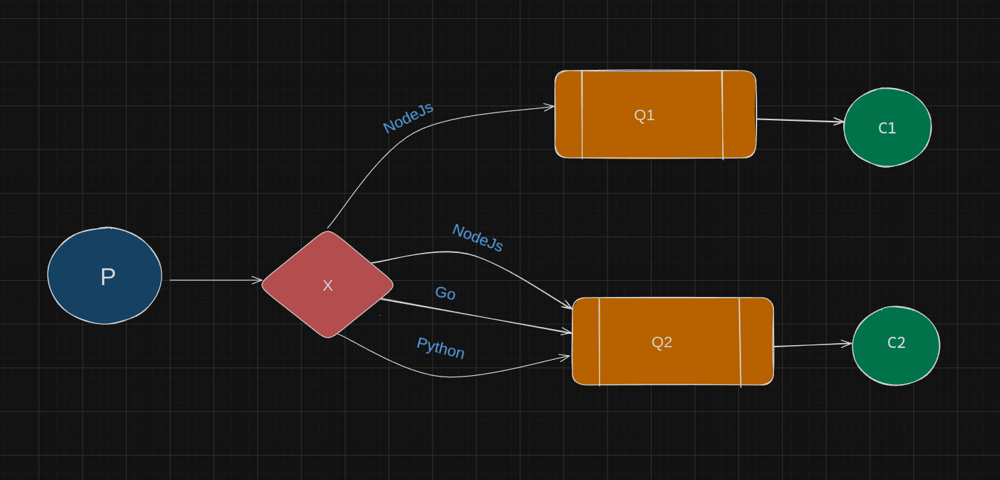
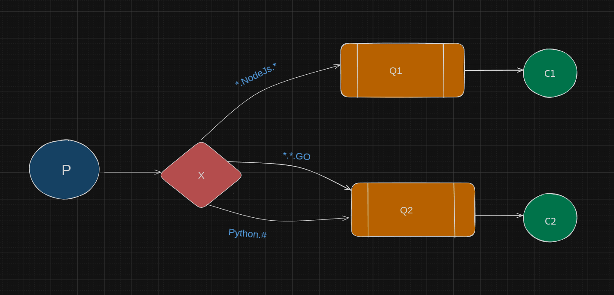
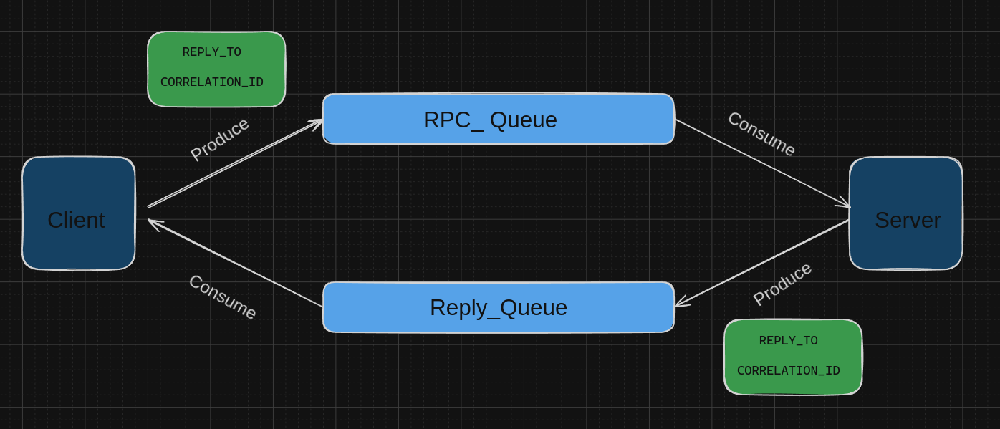
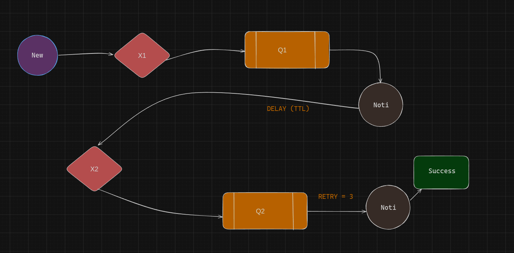
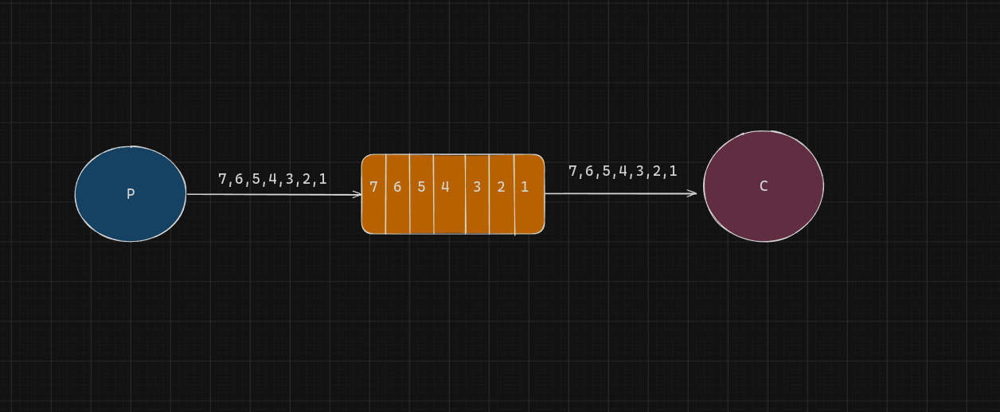
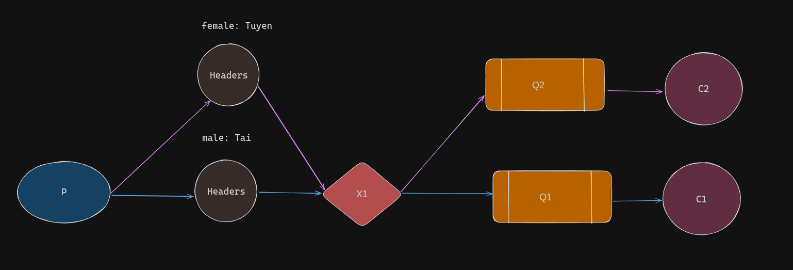

# 01. Producer/Consumer 



# 02. QUEUES



# 03. PUB/SUB



# 04. ROUTING



# 05. TOPICS



# 06. RPC ( Remote Procedure Call )



# 07. DLX ( Dead Letter Exchange )



# 08. EVENLY-DIST ( Evenly Distributing )



# 09. HEADERS



# 10. STREAM

```
         ┌───────────────────┐
         │     Producer      │
         │  (produce.js)     │
         └───────────────────┘
                   |
                   v
        ┌──────────────────────────┐
        │   Stream Queue (Rabbit)  │
        │   type=stream            │
        │   giữ tất cả message     │
        └──────────────────────────┘
                   |
                   v
        ┌──────────────────────────┐
        │       Consumer           │
        │    (consume.js)          │
        └──────────────────────────┘
                   |
        ┌──────────────────────────┐
        │ Data Warehouse (file)    │
        │ dataWarehouse.txt        │
        └──────────────────────────┘
                   |
        ┌──────────────────────────┐
        │ Offset Checkpoint         │
        │ offset.txt                │
        └──────────────────────────┘


```

# 11. DELAYED

```
          ┌────────────────┐
          │   Producer     │
          └────────────────┘
                   |
                   v
          ┌─────────────────────────────┐
          │   delay_queue_10s           │
          │  (TTL = 10s, DLX → main_ex) │
          └─────────────────────────────┘
                   |
   (Message giữ trong queue 10s)
                   |
      TTL hết hạn (10s trôi qua)
                   |
                   v
          ┌─────────────────────────────┐
          │        main_exchange        │
          │   (direct, routing key=go)  │
          └─────────────────────────────┘
                   |
                   v
          ┌─────────────────────────────┐
          │   delayed_target_queue      │
          │   (nơi Consumer lắng nghe)  │
          └─────────────────────────────┘
                   |
                   v
          ┌────────────────┐
          │   Consumer     │
          │ [✓] nhận msg   │
          └────────────────┘

```

# 12. DLX ( Dead Letter Exchange )

```
            +------------------+
            |   Producer       |
            | (DXL function)   |
            +--------+---------+
                     |
                     v
            +------------------+
            |  main_queue      |<-------------------+
            | (TTL = 5s)       |                    |
            | DLX = dlx_exchange                    |
            +--------+---------+                    |
                     |                              |
         (msg expired or rejected)                  |
                     |                              |
                     v                              |
            +------------------+                    |
            |  dlx_exchange    | (fanout exchange)  |
            +--------+---------+                    |
                     |                              |
                     v                              |
            +------------------+                    |
            | dead_letter_queue|--------------------+
            +------------------+


```

# 13. WORK ( New )

```
   +-------------+          +----------------+        +----------------+
   |             |   task   |                |        |                |
   |  Producer   +--------->+   Queue (tasks)+------->+  Worker 1      |
   |             |          |                |        | (Consumer)     |
   +-------------+          +----------------+        +----------------+
                                                      ^
                                                      |
                                                      |
                                                      v
                                               +----------------+
                                               |  Worker 2      |
                                               | (Consumer)     |
                                               +----------------+

```

# 14. TTL ( Time To Live )

```
   [Producer]
       |
       v
 ┌───────────────┐
 │  Queue (msg_ttl_queue) │
 └───────────────┘
       |
       | Message có TTL=5s
       |--------------------------> Nếu Consumer đọc trong 5s → xử lý OK
       |
       └──> Sau 5s -> Message tự động expire -> bị xóa khỏi queue


```

# 15. PRIORITY

```
                +-------------------+
                |   Producer App    |
                +-------------------+
                         |
     -------------------------------------------------
     |                       |                       |
     v                       v                       v
[Normal ticket]         [VIP ticket]         [Medium ticket]
 priority = 1           priority = 10         priority = 5
     |                       |                       |
     -------------------------+-----------------------+
                               v
                     ┌──────────────────┐
                     │ Priority Queue   │
                     │ (x-max-priority=10)
                     └──────────────────┘
                               |
                               v
                     +--------------------+
                     |   Consumer App     |
                     | (reads by priority)|
                     +--------------------+
                               |
           --------------------------------------------
           |                  |                       |
           v                  v                       v
   Process VIP          Process Medium           Process Normal
      (10)                   (5)                      (1)


```

# 16. EMAIL-RETRY-DLX
```
                 ┌───────────────────┐
                 │   EmailProducer   │
                 └─────────┬─────────┘
                           │
                           ▼
                 ┌───────────────────┐
                 │ ExchangeMain (direct)  
                 │   "email.main.ex" │
                 └─────────┬─────────┘
                           │ routingKey=email
                           ▼
                 ┌───────────────────┐
                 │   QueueMain       │
                 │   "email.main"    │
                 │  DLX → ExchangeRetry
                 └─────────┬─────────┘
                           │
             ┌─────────────┴────────────────┐
             │                              │
     [✓ Success]                      [✗ Fail → reject]
 channel.ack(msg)                 DLX → "email.retry.ex"
                                        │
                                        ▼
                         ┌────────────────────────┐
                         │    QueueRetry          │
                         │    "email.retry"       │
                         │ TTL=10s → DLX → Main   │
                         └─────────┬─────────────┘
                                   │ (sau 10s)
                                   ▼
                         ┌────────────────────────┐
                         │ ExchangeMain           │
                         └─────────┬─────────────┘
                                   │
                                   ▼
                         ┌────────────────────────┐
                         │ QueueMain (retry lần 2)│
                         └────────────────────────┘

        ┌─────────────────────────────────────────────┐
        │ Nếu retryCount >= 3                         │
        │ Worker publish → ExchangeDead (fanout)      │
        │   → QueueDead ("email.dead")                │
        └─────────────────────────────────────────────┘

                           ▼
                ┌──────────────────────┐
                │   EmailDeadConsumer   │
                │   Log/Debug Failures  │
                └──────────────────────┘
```

```
    📝 Giải thích ngắn gọn

    Producer gửi message vào email_exchange.

    email_queue nhận message, consumer sẽ xử lý (gửi email thật).

    Nếu gửi thành công → ACK → message biến mất.

    Nếu gửi thất bại (timeout, lỗi SMTP, …):

    Message sẽ chuyển sang DLX (dlx_exchange).

    DLX đưa message vào retry_queue.

    Sau khi hết TTL (ví dụ 10s), RabbitMQ tự động chuyển lại message về email_exchange để retry.

    Nếu retry quá số lần (ví dụ 3 lần), message sẽ đi vào dead_queue (bỏ hẳn, log lại để dev check).

```

## 👨‍💻 Author

Code Web Không Khó

---
## 📚 Dạy Học Online

Bên cạnh tài liệu miễn phí, mình còn mở các khóa học online:

- **Lập trình web cơ bản → nâng cao**
- **Ứng dụng về AI và Automation**
- **Kỹ năng phỏng vấn & xây CV IT**

### Thông Tin Đăng Ký

- 🌐 Website: [https://codewebkhongkho.com](https://codewebkhongkho.com/portfolios)
- 📧 Email: nguyentientai10@gmail.com
- 📞 Zalo/Hotline: 0798805741

---

## 💖 Donate Ủng Hộ

Nếu bạn thấy các source hữu ích và muốn mình tiếp tục phát triển nội dung miễn phí, hãy ủng hộ mình bằng cách donate.  
Mình sẽ sử dụng kinh phí cho:

- 🌐 Server, domain, hosting
- 🛠️ Công cụ bản quyền (IDE, plugin…)
- 🎓 Học bổng, quà tặng cho cộng đồng

### QR Code Ngân Hàng

Quét QR để ủng hộ nhanh:


**QR Code ABBank**  
- Chủ tài khoản: Nguyễn Tiến Tài  
- Ngân hàng: NGAN HANG TMCP AN BINH  
- Số tài khoản: 1651002972052

---

## 📞 Liên Hệ

- 📚 Facebook Dạy Học: [Code Web Không Khó](https://www.facebook.com/codewebkhongkho)
- 📚 Tiktok Dạy Học: [@code.web.khng.kh](https://www.tiktok.com/@code.web.khng.kh)
- 💻 GitHub: [fdhhhdjd](https://github.com/fdhhhdjd)
- 📧 Email: [nguyentientai10@gmail.com](mailto:nguyentientai10@gmail.com)

Cảm ơn bạn đã quan tâm & chúc bạn học tập hiệu quả! Have a nice day <3!!